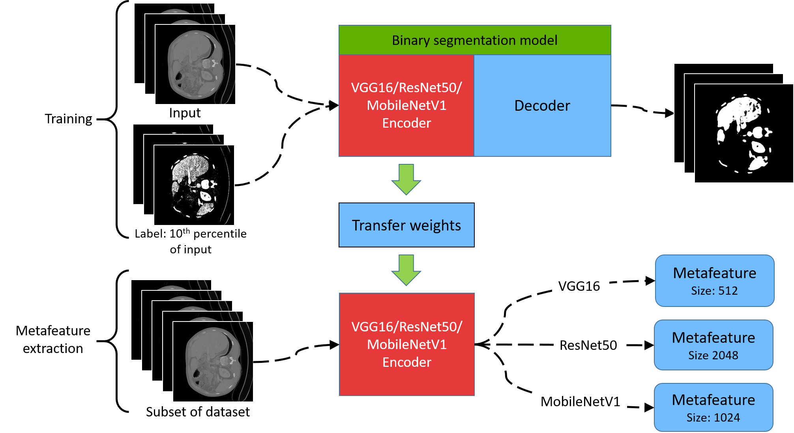

Medical_metafeatures
===============

Toolkit for extraction of metafeatures from medical datasets. Four different methods for metafeature extraction can be used.

## Description

Toolkit for extraction of metafeatures from medical datasets. Metafeatures are a compressed representation of a dataset which can be used in meta-learning to predict model performance for example. 4 different methods for metafeature extraction can be used. 

*Example of usage of metafeatures*


##### Types of metafeatures
* Statistical: standard numerical features of images in datasets (mean voxel value, kurtosis, skewness etc.), and features describing the relations between images in datasets (mutual information, correlation etc.). 
* VGG16/Resnet50/MobileNetV1: Deep learning based feature extraction from datasets. Network is finetuned without the need of labels and outputs a feature representation of a dataset which can be used as a metafeature.  


*Metafeature extraction using deep learning based methods*


Images should have .nii.gz extension.
(if your images have .nii format, gzip: https://www.gzip.org/ can be used for fast conversion)

## Installation

If you are using pip:

    pip install medical_metafeatures

If you are using conda, you can install from the `conda-forge` channel:

    conda install -c conda-forge medical_metafeatures
## Dependencies

The main `medical_metafeatures` requirement is:
* Python (>= 3.6)


## Installation

The installation process is similar to other packages available on pip:

```python
pip install -U medical_metafeatures
```

It is possible to install the development version using:

```python
pip install -U git+https://github.com/tjvsonsbeek/medical-mfe
```

or

```
git clone https://github.com/ealcobaca/pymfe.git
cd pymfe
python3 setup.py install
```
## Command-line usage

Use get_meta_features for the extraction of metafeatures. 

Example: 

    python -m medical_metafeatures.get_meta_features --task 'Example_dataset' --feature_extractors 'STAT' 'VGG16', --meta_suset_size 15 --generate_weights False --output_path 'dest' --task_path 'datasets' 
   
___
## Parameters for get_meta_features:
___
-t, --task\

Name of dataset or datasets on which metafeatures will be extracted as string. Multiple inputs are possible.

___
--feature_extractors

Feature extractors to use for metafeature extraction. Expected as string.  choose from 'STAT', 'VGG16', 'ResNet50' and  'MobileNetV1'. Multiple inputs are possible. 

Default = ['STAT', 'VGG16']
___
--load_labels

Choose whether to load metalabels. will throw error if there are no metalabels. Currently only works for medical decathlon datasets. Metalabels are not public yet.

Default = False
___
--meta_subset_size

Number of images on which metafeature is based.

Default = 20
____
--meta_sample_size\

Number of metafeatures per dataset. 

Default = 10
___
--generate_model_weights

Boolean which tells whether new model weights should be generated. Only used when deep learning based metafeature extraction is done. 

Default = True
___
--output_path

Path where all output will be saved

Default = 'metafeature_extraction_result'
___
--task_path.

Path in which to find the dataset folder. In this folder there should be a folder with the name of -t/--task. This folder should contain a ImagesTs folder with the images to extract the metafeature from in it. Images should have the .nii.gz extension.

Default = 'DecathlonData'
___
--finetune_ntrain

Number of training images in finetuning. Only applicable when generate_model_weights == True

Default = 800
___
--finetune_nval

Number of validation images in finetuning. Only applicable when generate_model_weights == True

Default = 200
___
--finetune_nepochs

Number of epochs in finetuning. Only applicable when generate_model_weights == True

Default = 5
___
--finetune_batch

Batch size in finetuning. Only applicable when generate_model_weights == True

Default = 5

Note
====

This project has been set up using PyScaffold 3.2.2. For details and usage
information on PyScaffold see https://pyscaffold.org/.
